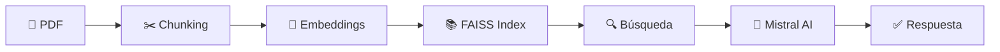

# 📄 PaperWhisper – Conversa con tus documentos

<div align="center">


[](https://paperwhisper.streamlit.app)
[](https://opensource.org/licenses/MIT)
[](https://www.python.org/downloads/)

**Convierte cualquier PDF en un asistente conversacional inteligente**

*Utiliza RAG (Retrieval-Augmented Generation) con Mistral AI para responder preguntas basándose únicamente en el contenido de tus documentos*

[Demo en Vivo](https://paperwhisper.streamlit.app) • [Documentación](./QUICKSTART.md) • [Arquitectura](./CLAUDE.md)

</div>

---

## 🎯 ¿Qué es PaperWhisper?

PaperWhisper es una aplicación open-source que transforma PDFs en asistentes conversacionales. Sube cualquier documento (papers académicos, libros, reportes) y hazle preguntas en lenguaje natural.

### ✨ Características principales

- 🚀 **Deploy en 1 click**: Listo para usar en Streamlit Cloud
- 🔒 **100% Local**: Índices FAISS almacenados localmente
- 🤖 **Mistral AI**: Respuestas precisas con modelos de última generación
- 🎨 **UI Moderna**: Interfaz intuitiva con Streamlit
- 📊 **Sin Límites**: Sin cuotas de documentos o preguntas
- 🔍 **Búsqueda Semántica**: Encuentra información relevante automáticamente

---

## 🚀 Demo en Vivo

**Pruébalo aquí:** [paperwhisper.streamlit.app](https://paperwhisper.streamlit.app)

> 💡 **Nota:** La primera carga puede tomar unos segundos (descarga del modelo de embeddings)

---

## 🧠 ¿Cómo funciona?



1. **Sube un PDF** → El documento se procesa automáticamente
2. **Chunking inteligente** → División en fragmentos semánticamente coherentes
3. **Embeddings** → Generación de vectores con HuggingFace (sentence-transformers)
4. **Indexado FAISS** → Almacenamiento local para búsquedas rápidas
5. **Pregunta en lenguaje natural** → El sistema encuentra los fragmentos relevantes
6. **Respuesta con IA** → Mistral AI genera respuestas basadas en el contexto

---

## 🧰 Stack Tecnológico

| Componente | Tecnología |
|------------|------------|
| **LLM** | Mistral AI (mistral-small/medium/large) |
| **Embeddings** | HuggingFace Sentence Transformers |
| **Vector Store** | FAISS (local, persistente) |
| **Framework** | LangChain |
| **Backend** | Python 3.8+ |
| **Frontend** | Streamlit |
| **PDF Processing** | PyPDF |

---

## 📦 Instalación Local

### Opción 1: Script Automático (Recomendado)

```bash
git clone https://github.com/antuansabe/PaperWhisper.git
cd PaperWhisper
./setup.sh
source .venv/bin/activate
streamlit run app.py
```

### Opción 2: Manual

```bash
# Clonar repositorio
git clone https://github.com/antuansabe/PaperWhisper.git
cd PaperWhisper

# Crear entorno virtual
python3 -m venv .venv
source .venv/bin/activate  # Windows: .venv\Scripts\activate

# Instalar dependencias
pip install -r requirements.txt

# Configurar variables de entorno
cp .env.example .env
# Edita .env y agrega tu MISTRAL_API_KEY

# Ejecutar aplicación
streamlit run app.py
```

---

## 🔑 Configuración

### Variables de Entorno

Crea un archivo `.env` con:

```bash
# API Key de Mistral AI (obtén una gratis en https://console.mistral.ai/)
MISTRAL_API_KEY=your_key_here

# Modelo de embeddings (default recomendado)
EMBEDDINGS_MODEL=sentence-transformers/all-MiniLM-L6-v2

# Directorio para datos
DATA_DIR=./data
```

### Obtener API Key de Mistral

1. Ve a [console.mistral.ai](https://console.mistral.ai/)
2. Crea una cuenta (gratis)
3. Genera una API key
4. Cópiala en tu `.env`

---

## 🎮 Uso

### Interfaz Web

1. **Sube un PDF** → Arrastra o selecciona desde tu computadora
2. **Espera el procesamiento** → Toma 5-10 segundos
3. **Haz preguntas** → Escribe en lenguaje natural
4. **Revisa resultados** → Ve los fragmentos relevantes y la respuesta generada

### Configuración Avanzada (Sidebar)

- **Modelo de Mistral**: Selecciona entre small/medium/large
- **Top-K Chunks**: Ajusta cuántos fragmentos recuperar (3-5 recomendado)
- **Limpiar Índice**: Reconstruye el índice FAISS

---

## 📁 Estructura del Proyecto

```
PaperWhisper/
├── app.py                 # Aplicación Streamlit principal
├── src/
│   └── rag_engine.py     # Motor RAG (8 funciones modulares)
├── requirements.txt       # Dependencias Python
├── .env.example          # Template de variables de entorno
├── setup.sh              # Script de instalación
├── test_rag_engine.py    # Suite de pruebas
├── QUICKSTART.md         # Guía de inicio rápido
├── IMPLEMENTATION.md     # Detalles técnicos
└── CLAUDE.md            # Documentación de arquitectura
```

---

## 🧪 Testing

Ejecuta la suite de pruebas:

```bash
python test_rag_engine.py
```

Deberías ver:
```
✅ PASS - Imports
✅ PASS - Embeddings
✅ PASS - Text Splitting
✅ PASS - FAISS Index
✅ PASS - Mistral Connection

🎯 Resultado: 5/5 pruebas exitosas
```

---

## 🚀 Deploy en Streamlit Cloud

### Paso 1: Fork o Clone el Repo

Ya tienes el código en GitHub ✅

### Paso 2: Crear App en Streamlit Cloud

1. Ve a [share.streamlit.io](https://share.streamlit.io/)
2. Login con GitHub
3. Click "New app"
4. Configuración:
   - **Repository**: `antuansabe/PaperWhisper`
   - **Branch**: `main`
   - **Main file**: `app.py`

### Paso 3: Agregar Secrets

En "Advanced settings" > "Secrets", agrega:

```toml
MISTRAL_API_KEY = "tu_api_key_aqui"
EMBEDDINGS_MODEL = "sentence-transformers/all-MiniLM-L6-v2"
DATA_DIR = "./data"
```

### Paso 4: Deploy! 🎉

Tu app estará live en: `https://paperwhisper.streamlit.app`

---

## 💡 Casos de Uso

- 📚 **Investigación académica**: Analiza papers y obtén resúmenes
- 📄 **Documentos legales**: Consulta contratos y políticas
- 📖 **Libros técnicos**: Encuentra información específica rápidamente
- 📊 **Reportes corporativos**: Extrae insights de documentos extensos
- 🎓 **Estudio**: Haz preguntas sobre tus materiales de clase

---

## 🛣️ Roadmap

- [x] Implementación RAG básica
- [x] Integración Mistral AI
- [x] Deploy en Streamlit Cloud
- [ ] Soporte para múltiples PDFs
- [ ] Historial de conversaciones
- [ ] Exportar respuestas (PDF/Markdown)
- [ ] Búsqueda híbrida (keyword + semántica)
- [ ] Soporte para otros formatos (DOCX, TXT)
- [ ] API REST

---

## 🤝 Contribuciones

¡Las contribuciones son bienvenidas! Por favor:

1. Fork el proyecto
2. Crea una branch (`git checkout -b feature/AmazingFeature`)
3. Commit tus cambios (`git commit -m 'Add some AmazingFeature'`)
4. Push a la branch (`git push origin feature/AmazingFeature`)
5. Abre un Pull Request

---

## 📄 Licencia

Distribuido bajo la Licencia MIT. Ver `LICENSE` para más información.

---

## 👤 Autor

**Antonio Sabe**

- GitHub: [@antuansabe](https://github.com/antuansabe)
- LinkedIn: [Agregar tu LinkedIn aquí]

---

## 🙏 Agradecimientos

- [Streamlit](https://streamlit.io/) - Framework de UI
- [LangChain](https://python.langchain.com/) - Orquestación RAG
- [Mistral AI](https://mistral.ai/) - Modelos de lenguaje
- [FAISS](https://github.com/facebookresearch/faiss) - Búsqueda vectorial
- [HuggingFace](https://huggingface.co/) - Modelos de embeddings

---

<div align="center">

**⭐ Si este proyecto te fue útil, considera darle una estrella!**

Made with ❤️ and ☕ by Antonio Sabe

</div>
